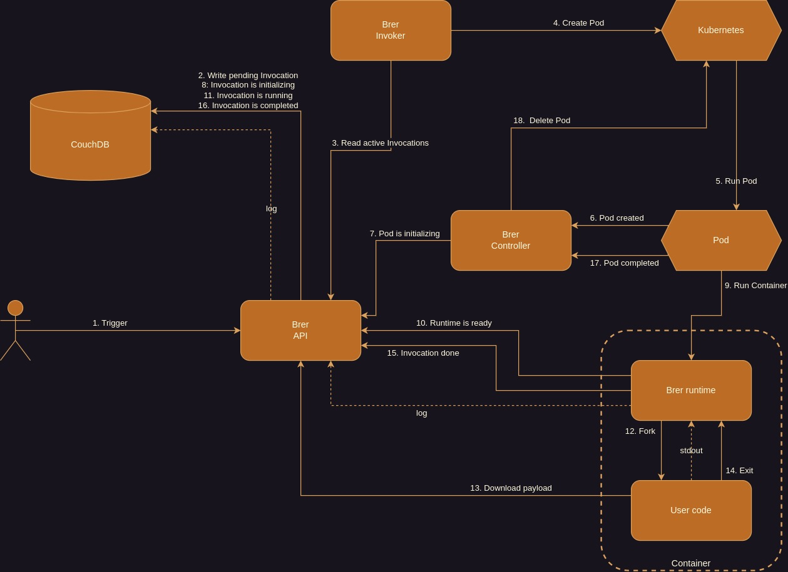

# Brer

A simple Kubernetes task runner.

## Why

Brer is a simple task runner that uses some core Kubernetes features for process management.

The whole point of this project is to be a simple and effective task runner without doing other similar things (like a serverless framework). The goal is to schedule and manage multiple isolated tasks and be able to monitor them with ease. Unlike other similar projects, Pod images are left untouched, leaving full freedom to the developers. Small dependencies will be available for the major languages to integrate with Brer.

## Overview

### Components

- [API server](https://github.com/brer/brer-api)
- [Invoker](https://github.com/brer/brer-invoker)
- [Controller](https://github.com/brer/brer-controller)
- [Web UI](https://github.com/brer/brer-web)
- [CLI](https://github.com/brer/brer-cli)

### Runtimes

- [Node.js](https://github.com/brer/brer-nodejs)

## Roadmap

- [x] Invocation init timeout
- [x] See Invocations' logs
- [x] Use Kubernetes secrets
- [x] Arbitrary payload for Invocations
- [x] Recover running Invocations without Pod
- [x] Runtime validation after image update
- [x] [Web UI](https://github.com/brer/brer-web)
- [x] [Node.js bindings](https://github.com/brer/brer-nodejs)
- [x] Previous Invocations history limit
- [x] Authentication and authorization
- [x] Stop Invocations
- [x] Progress update
- [x] Configure pod resources (cpu and memory)
- [x] Max global concurrent Invocations limit (enqueue pending Invocations)
- [x] Retry Invocation on error (retry attempts)
- [x] Pending Pod timeout
- [ ] Swagger/OpenAPI (partial)
- [ ] Helm chart
- [ ] Webhooks
- [ ] Go bindings
- [ ] Rust bindings
- [ ] CLI
- [ ] Play/Pause Invocations
- [ ] Invocation max running time

## Acknowledgements

This project is kindly sponsored by [Evologi](https://evologi.it/).
